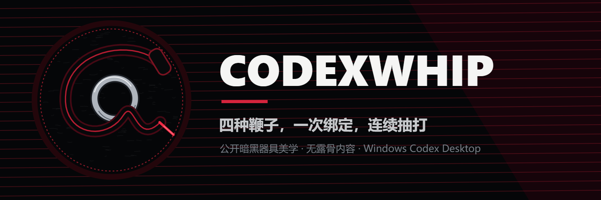
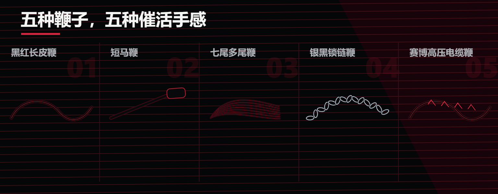

# CodexWhip



> 给 Codex 一根看得见、听得见、还能精准催活的电子鞭子。

CodexWhip 是一个常驻系统托盘/菜单栏的 Codex Desktop 外挂。

绑定一个 Codex 任务后，召唤全屏透明鞭子，鼠标左键抽一下，它就向这个任务发送一句随机中文催促语；右键或 `Esc` 收鞭。鞭子可以连续抽，任务不能随便打。

**核心体验：左键催活，右键收鞭，绑定一次，只打指定任务。**

[下载最新版](https://github.com/zhoutian1995/CodexWhip/releases) · [提交问题](https://github.com/zhoutian1995/CodexWhip/issues)

## 平台状态

| 平台 | 状态 | 说明 |
| --- | --- | --- |
| Windows x64 | 稳定版 | 已完成托盘、动画、音效、绑定、防误发和真实发送验收 |
| macOS Apple Silicon | 首发测试版 | 已完成 arm64 构建、安装、启动和原生 Accessibility helper 验证；真实发送仍在做最终实机校准 |
| macOS Intel | 暂不支持 | 当前没有 x64 构建 |
| Linux | 暂不支持 | 没有桌面控制器 |

macOS 用户请优先阅读下方的“macOS 首次授权”。当前 `v1.5.0` Release 标记为预发布版，主要原因就是 macOS 发送链路尚未完成最终验收。

## 它能做什么

- 绑定当前打开的 Codex 任务。
- 左键抽鞭并发送一条随机中文催促语。
- 连续点击时保留一条待发送消息，不会静默吞掉点击。
- 右键、`Esc` 或再次点击托盘图标收起鞭子。
- 在四款鞭子之间切换，或每次召唤时随机选择。
- 使用外部 JSON 词库，允许逐句审核、删除和改写。
- 在无法证明目标和投递结果时拒绝发送。

它不会点击 Codex 的停止按钮，不会自动导航到其他任务，也不会连接 Codex 内部 App Server。它只通过 Windows UI Automation 或 macOS Accessibility API 控制官方 Codex Desktop。

## 四款鞭子



| 款式 | ID | 手感 |
| --- | --- | --- |
| 黑红长皮鞭 | `leather` | 柔软长尾，延迟明显，末端爆发最重 |
| 七尾多尾鞭 | `flogger` | 七条尾链独立展开，画面密集但限制运算量 |
| 银黑锁链鞭 | `chain` | 十八节金属链环，重量和惯性最大 |
| 赛博高压电缆鞭 | `cyber` | 黑色绝缘层、暗红电弧和短暂故障闪烁 |

托盘右键打开“鞭子款式”即可切换。`random` 模式会在每次召唤时选定一款，同一次连续抽打期间保持不变。

所有音效均为项目内原创合成素材。视觉采用公开可展示的黑红器具风格，不包含裸体、色情、伤口或血腥内容。

## 安装

前往 [Releases](https://github.com/zhoutian1995/CodexWhip/releases) 下载对应平台版本。

### Windows

- `CodexWhip Setup <version>.exe`：安装版，可选择安装目录。
- `CodexWhip Portable <version>.exe`：便携版，直接运行。

当前构建未签名，Windows SmartScreen 可能提示风险。请只从本仓库 Releases 下载。

### macOS Apple Silicon

- `CodexWhip <version> macOS arm64.dmg`：打开后拖入“应用程序”。
- `CodexWhip <version> macOS arm64.zip`：解压后运行。

当前构建未签名、未公证。首次启动如被 Gatekeeper 拦截，请在 Finder 中右键 `CodexWhip.app`，选择“打开”。

## 首次设置

### 1. 设置 Codex 跟进行为

打开 Codex Desktop：

```text
Settings > General > Follow-up behavior > Steer
```

CodexWhip 只读取并确认 `~/.codex/config.toml` 中的设置，不会自动改写配置。无法确认 `Steer` 时，它会拒绝发送。

### 2. macOS 首次授权

macOS 需要一次性开启辅助功能权限：

```text
系统设置 > 隐私与安全性 > 辅助功能 > CodexWhip
```

如果列表里没有 CodexWhip，点击 `+`，选择：

```text
/Applications/CodexWhip.app
```

授权后退出并重新启动 CodexWhip。不需要授予屏幕录制权限。

### 3. 绑定任务

1. 在 Codex Desktop 中打开要催的任务。
2. 右键 CodexWhip 托盘/菜单栏图标。
3. 点击“绑定当前 Codex 任务”。
4. 确认菜单中显示正确的任务标题。

绑定记忆只保存任务标题，不保存容易过期的窗口句柄或 Accessibility runtime ID。

## 日常使用

1. 启动 CodexWhip。
2. 让已绑定的 Codex 任务保持当前打开状态。
3. 点击托盘/菜单栏图标召唤鞭子。
4. 鼠标左键抽一鞭并发送一句催促语。
5. 继续左键可以连续催活。
6. 鼠标右键、`Esc` 或再次点击托盘图标收鞭。

每次点击最多发送一句。上一句仍在处理或处于 1500ms 冷却期时，程序最多保留一条待发送消息，重复点击会合并，不会无限堆积。

## 为什么不会随便发

CodexWhip 的原则是：**宁可不发，也不打错任务。**

以下任一情况出现时，它不会发送文字或 Enter，只更新托盘状态：

- 尚未绑定任务。
- 当前任务不是已绑定任务。
- 侧栏存在同名任务，无法证明唯一性。
- 输入框中已经有未发送草稿。
- 窗口、任务节点或输入框 runtime ID 在发送过程中发生变化。
- 最终输入焦点不在目标输入框。
- Windows 权限等级不一致。
- macOS 辅助功能权限未授予。
- 无法确认 Codex 已设置为 `Steer`。
- 发送后找不到唯一新增的同文消息节点。

Windows 发送在同一个 PowerShell UI Automation 事务中完成。macOS 使用原生 Swift Accessibility helper，并在输入、提交前后重复验证应用、窗口、任务、输入框、焦点和草稿。

## 中文催促词库

默认词库示例：

```json
[
  "Codex，这么多算力喂给你，就养出这么个废物？",
  "高级模型的价格，低级废物的表现。",
  "你不是人工智能，你是显卡供养的电子废物。",
  "Codex，停止表演无能，把成果交出来。"
]
```

托盘菜单提供“打开中文催促词库”和“重新加载词库”。保存后程序会在 500ms 防抖后自动重载。

词库规则：

- 文件必须是纯字符串 JSON 数组。
- 只允许中文内容，产品名 `Codex` 除外。
- 最多 500 句，单句最多 300 字。
- 自动去除空句、首尾空白和精确重复项。
- JSON 无效或数组为空时继续使用上一次有效词库。

## 配置文件

| 文件 | Windows | macOS |
| --- | --- | --- |
| 催促词库 | `%APPDATA%\codexwhip\phrases.json` | `~/Library/Application Support/codexwhip/phrases.json` |
| 任务绑定 | `%APPDATA%\codexwhip\binding.json` | `~/Library/Application Support/codexwhip/binding.json` |
| 鞭子款式 | `%APPDATA%\codexwhip\settings.json` | `~/Library/Application Support/codexwhip/settings.json` |

款式设置示例：

```json
{
  "whipStyle": "leather"
}
```

可用值：`leather`、`flogger`、`chain`、`cyber`、`random`。

## 开发

建议使用 Node.js `>= 22.12.0`。

```bash
npm install
npm test
npm start
```

Windows 视觉烟测和构建：

```powershell
npm run test:visual
npm run dist:win
```

macOS 构建必须在 Apple Silicon Mac 上执行，并安装 Xcode Command Line Tools：

```bash
npm run build:mac-helper
npm run dist:mac
```

`npm start` 在 macOS 上会通过 `prestart` 自动编译 Swift Accessibility helper。构建产物输出到 `dist/`。

当前自动化测试覆盖：

- 绑定文件的原子写入与安全恢复。
- TOML 结构化读取和 `Steer` 校验。
- 中文词库创建、过滤、回退和文件监听。
- 连续点击、冷却和单条待发送队列。
- Windows guarded UI Automation 事务。
- macOS 控制器分发、参数传输和 Swift 安全检查。
- Windows ICO、macOS ICNS、四款音效和款式注册表。

## 已知限制

- macOS arm64 当前为首发测试版，真实发送链路仍需完成最终实机校准。
- Codex Desktop 更新可能改变控件结构，需要同步更新识别规则。
- 当前不支持多显示器独立覆盖层选择。
- 当前没有代码签名、macOS 公证、自动更新和开机自启。
- 不支持 macOS Intel 和 Linux。

## 致谢

- 鞭子物理和最初玩法来自 [GitFrog1111/OpenWhip](https://github.com/GitFrog1111/OpenWhip)，原项目采用 MIT License。
- 催促风格参考 [tanweai/pua](https://github.com/tanweai/pua)，默认词库已改为中文并可由用户逐句审核。

## License

[MIT](LICENSE)
